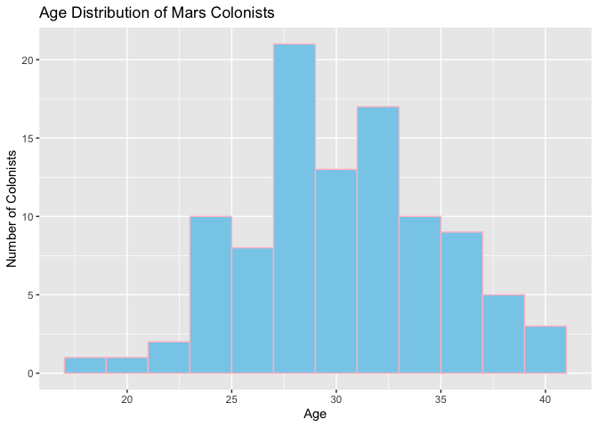
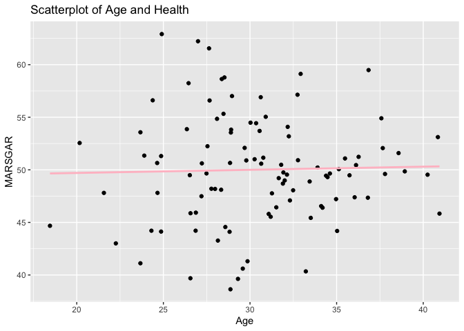
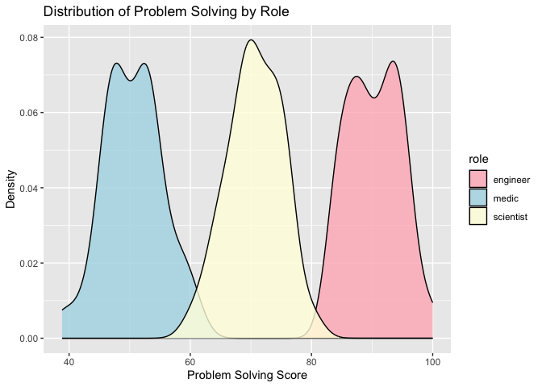

Lab 13 - Colonizing Mars
================
Yanying Li
05012025

### Load packages and data

``` r
library(tidyverse) 
if (!require("ggplot2")) install.packages("ggplot2")
library(ggplot2)

if (!require("MASS")) install.packages("MASS")
library(MASS)

# Install and load the tidyverse package
if (!require("tidyverse")) install.packages("tidyverse")
library(tidyverse)
```

### Exercise 1

``` r
set.seed(123)
age <- rnorm(100, mean = 30, sd = 5)
df_colonists <- data.frame(
  id = 1:100, 
  age = age
) 

##Visualization:
ggplot(df_colonists, aes(x = age)) +
  geom_histogram(binwidth = 2, fill = "skyblue", color = "pink") +
  labs(title = "Age Distribution of Mars Colonists",
       x = "Age",
       y = "Number of Colonists") 
```

<!-- -->

### Exercise 1.2

The three sets seem to have relatively normal distributions, with
centers around age 30 and ranging from 15 to 45. Most of the ages are
between 25 to 35. It seems like seeds controls the general distribution
of the generated random samples, such as the mean, sd, and total
numbers.

I wonder if you might want us to draw the three visualization. It is a
way to practice having three sets of seeds and generate distribution,
which might be fun.

### Exercise 1.3

``` r
set.seed(1)
df_colonists$role <- rep(c("engineer", "scientist", "medic"),
  times = c(33, 33, 33),
  length.out = 100
)
```

I used this one because I think it helps with equal distribution, and I
would have a consistent and repeating pattern to make sure the roles are
(almost) equally generated. Although there is one more engineer, I think
this is the best way to have almost equal numbers of roles.

### Exercise 1.4

``` r
set.seed(100)

df_colonists$marsgar <- rnorm(100, mean = 50, sd = 5)

ggplot(df_colonists, aes(
    x = age,
    y = marsgar
  ) )+
  geom_point()+
  geom_smooth(method=lm, color = "pink",se = FALSE)+
  labs(
      x = "Age",
      y = "MARSGAR",
      title = "Scatterplot of Age and Health"
  )
```

    ## `geom_smooth()` using formula = 'y ~ x'

<!-- -->

I think for learning about seed(), you can ask about using the same set
seed for the graph first and then using a different one as the seed()
used for age. I think this helps you illustrate the point that why no
correlation is observed here!

### Exercise 2.1

``` r
set.seed(1235)

df_colonists$technical_skills <- 2 * df_colonists$age + rnorm(100, mean = 0, sd = 1)

##visualization
##I do not see this as a suggestion, but I really like how your graph has the function as well, so i asked GPT to help me generate it. I am wondering if you would want students to have this as well since it is easier to see what is the intercept and coefficient. 

# the linear model
technical_model <- lm(technical_skills ~ age, data = df_colonists)
#Extract coefficients
intercept <- round(coef(technical_model)[1], 2)
slope <- round(coef(technical_model)[2], 2)

#Create equation text
eqn <- paste0("y = ", intercept, 
              ifelse(slope >= 0, " + ", " - "), 
              abs(slope), "x")

ggplot(df_colonists, aes(x = age, y = technical_skills)) +
  geom_point(color = "pink", alpha = 0.6) +
  geom_smooth(method = "lm", se = TRUE, color = "lightblue") +
  geom_label(aes(x = 22, y = max(technical_skills) - 5, label = eqn),
             fill = "white", color = "black",
             label.size = 0.5, label.padding = unit(0.2, "lines"))+
  labs(title = "Relationship Between Age and Technical Skills",
       x = "Age",
       y = "Technical Skills")
```

    ## Warning in geom_label(aes(x = 22, y = max(technical_skills) - 5, label = eqn), : All aesthetics have length 1, but the data has 100 rows.
    ## ℹ Please consider using `annotate()` or provide this layer with data containing
    ##   a single row.

    ## `geom_smooth()` using formula = 'y ~ x'

<!-- -->

### Exercise 2.2

``` r
## In my understanding, eginner might have the highest problem solving skills because they are often solving complex technical issues. After that might be scientist since they also mostly working with exploring and investigating problems and questions. Medics might have the least problem-solving ability since they focused more on curing and treating people. 
set.seed(132)

df_colonists$problem_solving[df_colonists$role == "engineer"] <-
  pmin(rnorm(sum(df_colonists$role == "engineer"), mean = 90, sd = 5), 100)

df_colonists$problem_solving[df_colonists$role == "scientist"] <-
  pmin(rnorm(sum(df_colonists$role == "scientist"), mean = 70, sd = 5), 100)

df_colonists$problem_solving[df_colonists$role == "medic"] <-
  pmin(rnorm(sum(df_colonists$role == "medic"), mean = 50, sd = 5), 100)
#problem_solving = role + noise
# Define base scores for each role
ggplot(df_colonists, aes(x = problem_solving, fill = role)) +
  geom_density(alpha = 0.8) +
  scale_fill_manual(values=c("lightpink", "lightblue","lightyellow"))+
  labs(title = "Distribution of Problem Solving by Role",
       x = "Problem Solving Score",
       y = "Density") 
```

<!-- -->

I really like this exercise so I do not have much suggestions! I did add
one thing to make the scores above 100 got cut because that will not
make sense.

### Exercise 3.1

### Exercise 3.2

### Exercise 3.3
